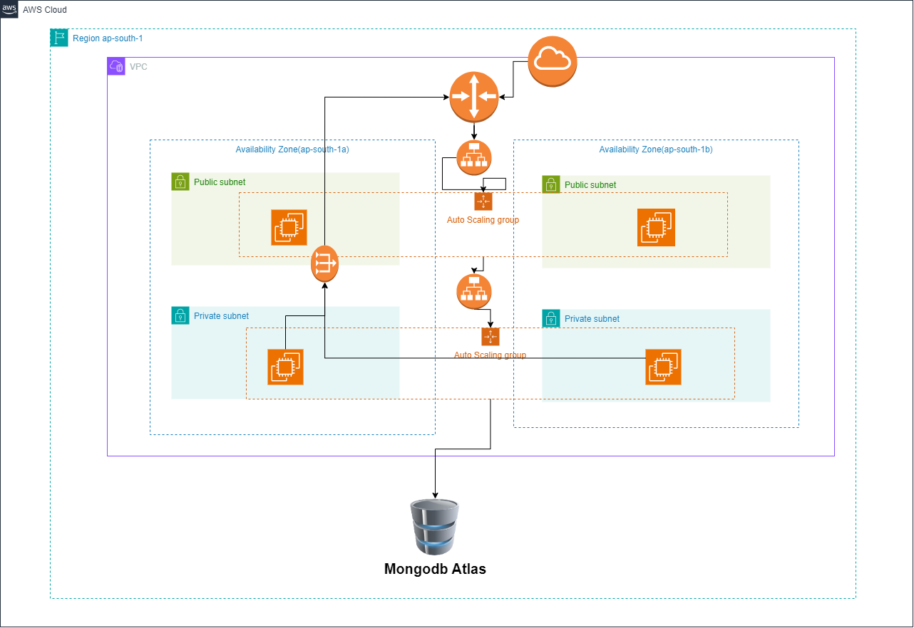

# EZDeploy

 EZDeploy is a fully automated Terraform solution that provisions a production-grade 3-tier infrastructure on AWS and deploys a live React frontend and Node.js backend app without any manual configuration.

## Architecture


## 🚀 Features

- Provisions ~48 AWS resources using Terraform
- Installs frontend and backend apps automatically via startup scripts
- Outputs a public Load Balancer DNS to access the live app
- Requires no manual installation once configured

## ⚙️ Requirements
- Terraform CLI installed

- AWS account with programmatic access

- Two GitHub repos:

- React frontend (running on port 3000)

- Node.js backend (running on port 5000)

- Both repos must include valid .env files

## Project Structure
```
EZDeploy/
├── modules/                # Terraform modules (VPC, EC2, etc.)
├── installClient.sh        # Auto-installs frontend app
├── installServer.sh        # Auto-installs backend app
├── main.tf                 # Infrastructure root config
├── output.tf               # Outputs (e.g., Load Balancer DNS)
├── provider.tf             # AWS provider config
├── variable.tf             # Input variables
└──variables_secret.tf      # variable secrets file
```

## 📦 How to Use

### 1. Clone the repository

```bash
git clone https://github.com/ArmanNavodia/EZDeploy.git
cd EZDeploy
```
### 2. Update the install scripts:

Edit installClient.sh and installServer.sh, replacing the sample GitHub URLs with your actual React and Node.js repo links.


### 3. 🔐 Security & Environment Configuration
To securely provide cloud and database credentials, use environment variables or the AWS credentials file.

##### 🟩 AWS Keys Setup
Option 1: Environment Variables (Recommended for automation)
Set these in your terminal:
```bash
export AWS_ACCESS_KEY_ID="your-access-key-id"
export AWS_SECRET_ACCESS_KEY="your-secret-access-key"
export AWS_DEFAULT_REGION="ap-south-1"
```
Option 2: AWS CLI Credentials File
Edit ~/.aws/credentials (Linux/macOS) or %UserProfile%\.aws\credentials (Windows):
```bash
[default]
aws_access_key_id = your-access-key-id
aws_secret_access_key = your-secret-access-key
```
And configure your region in ~/.aws/config:
```bash
[default]
region = ap-south-1
```

🍃 MongoDB Atlas Environment Variables

```bash
export TF_VAR_atlas_public_key="your_public_key_here"
export TF_VAR_atlas_private_key="your_private_key_here"
```

### 4. Run Terraform:
```bash
terraform init
terraform apply -auto-approve
```

## 📌 Notes
- Terraform version: 1.0+

- AWS region: us-east-1 (can be changed in provider.tf)

- Works only with React frontends and Node.js backends

